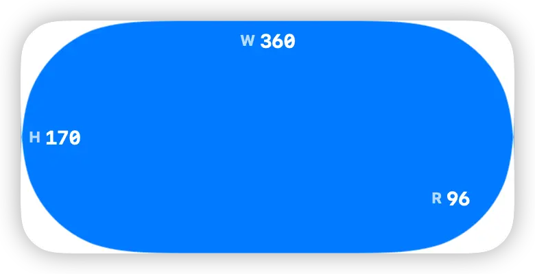

# Measure

An Await widget for development and device checks. It shows the current widget size and helps measure the rounded corner radius used by the host device.

The widget reads its render size from Await and displays:

- `W`: the current widget width, shown along the top edge
- `H`: the current widget height, shown along the left edge
- `R`: the configured background corner radius, shown near the bottom-right corner

Use it when building widgets to quickly confirm how large each widget family renders on the current device. To measure the device corner radius, adjust `backgroundCornerRadius` until the blue background matches the host widget corner, then read the `R` value.

## Configuration

Open the widget panel and set:

- `backgroundCornerRadius`: the rounded rectangle radius used by the widget background

The `R` label is inset based on the configured radius so it stays inside the rounded corner while measuring larger values.

## Usage

See the project root's [README.md](../../README.md#usage) for general usage instructions.
