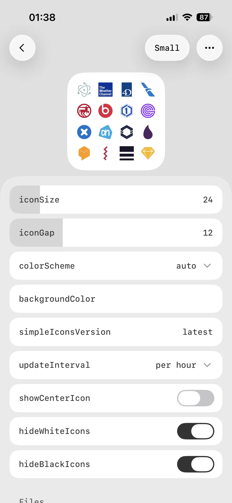
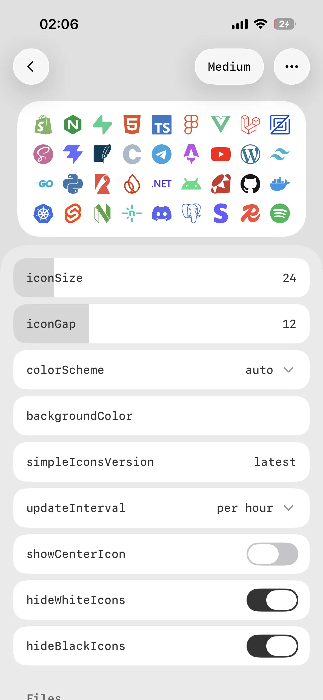
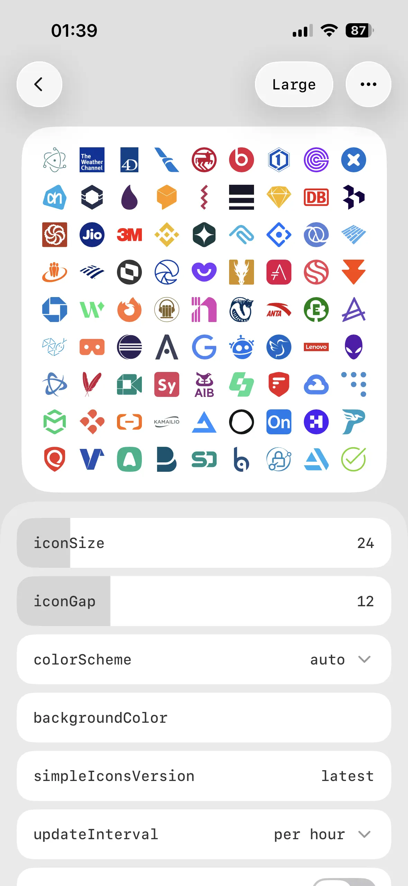

# Simple Icons Wall

An Await widget that renders a configurable Simple Icons wall.

The widget reads the current widget size from Await and uses it as the render area. Only icon layout values need to be configured.

## Screenshots

|                          Small                           |                          Medium                           |                          Large                           |
| :------------------------------------------------------: | :-------------------------------------------------------: | :------------------------------------------------------: |
|  |  |  |

## Configuration

Open the widget panel and set:

- `iconSize`: size of each background icon
- `iconGap`: spacing between icons and the widget edges
- `colorScheme`: use the host color scheme or force light/dark
- `backgroundColor`: background color, defaulting to automatic white/black when empty
- `simpleIconsVersion`: the Simple Icons package version from jsDelivr, defaulting to `latest`
- `updateInterval`: reshuffle by time, either `per minute`, `per hour`, or `per day`
- `showCenterIcon`: whether to show the center Simple Icons logo
- `hideWhiteIcons`: hide background icons whose original brand color is white
- `hideBlackIcons`: hide background icons whose original brand color is black

The icon list is loaded from jsDelivr's `data/simple-icons.json` for the configured Simple Icons version and cached for later renders. The center Simple Icons logo is scaled automatically from the current grid.
