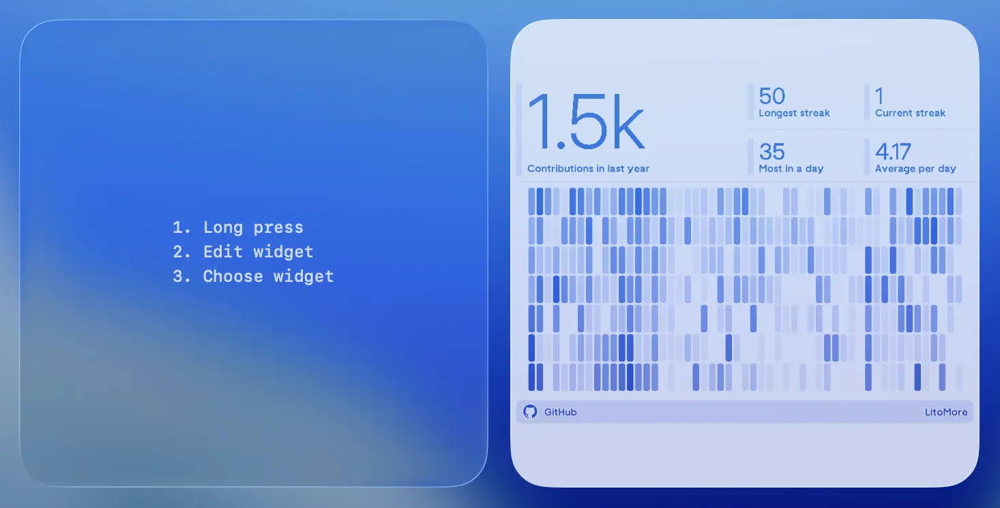

# TRMNL

An Await widget that shows the current TRMNL display image using a device API key, with optional color inversion and transparency.

## Usage

1. Download the Await app from the [App Store](https://apps.apple.com/app/id6755678187)
1. Open the Await app and create a new widget with name "TRMNL"
1. Press the "TRMNL" from the list of available widgets to open the configuration panel
1. Press the `index.tsx` from the `Files` section to open the code editor and copy the [TRMNL widget code](./index.tsx) to the editor, then press "Save"
1. You will be able to see `trmnlDeviceApiKey`, `apiBaseUrl`, `colorInvert`, and `useTransparent` fields in the widget panel
1. Configure your TRMNL [device API key](https://docs.trmnl.com/go/private-api/screens), base URL, and display effects in the widget panel
1. Go to your device home screen/desktop and add the Await widget
1. Long press the widget and tap "Edit Widget"
1. Choose your widget from the list
1. The widget will display the current TRMNL display image

## Configuration

- `trmnlDeviceApiKey`: a TRMNL device API key, entered as a password field
- `apiBaseUrl`: the TRMNL API base URL
- `colorInvert`: whether to invert the display image colors
- `useTransparent`: whether to make the light areas of the display image transparent
